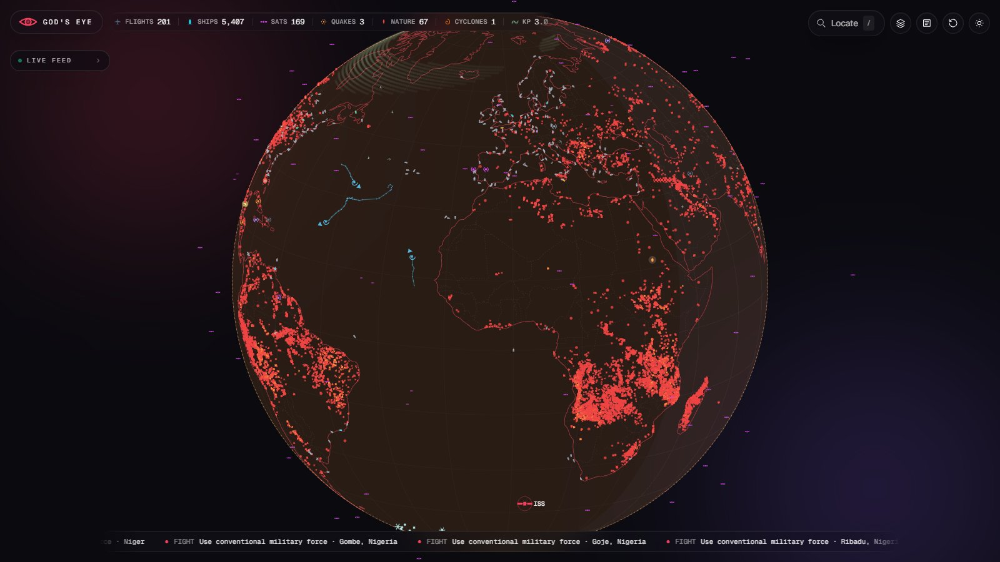
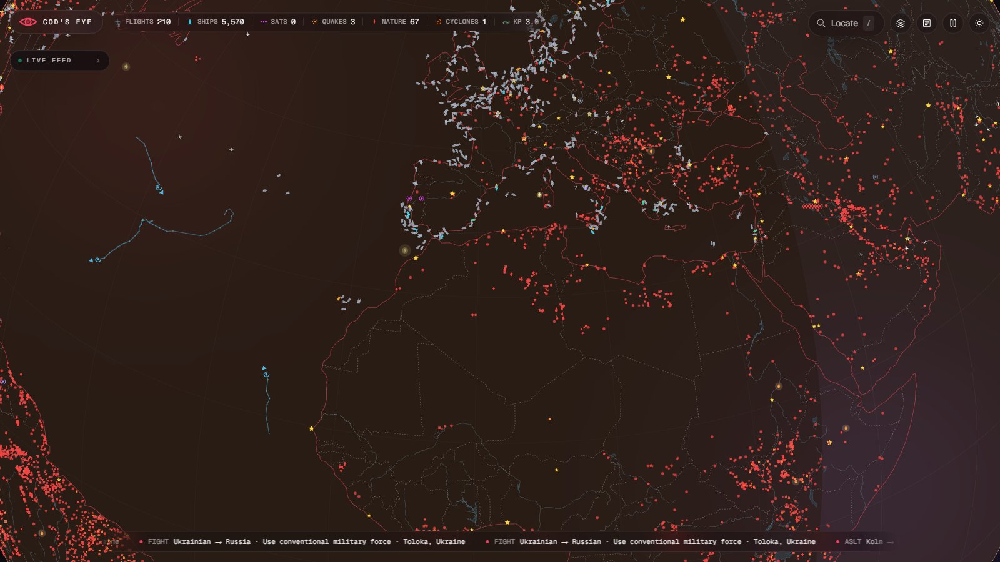
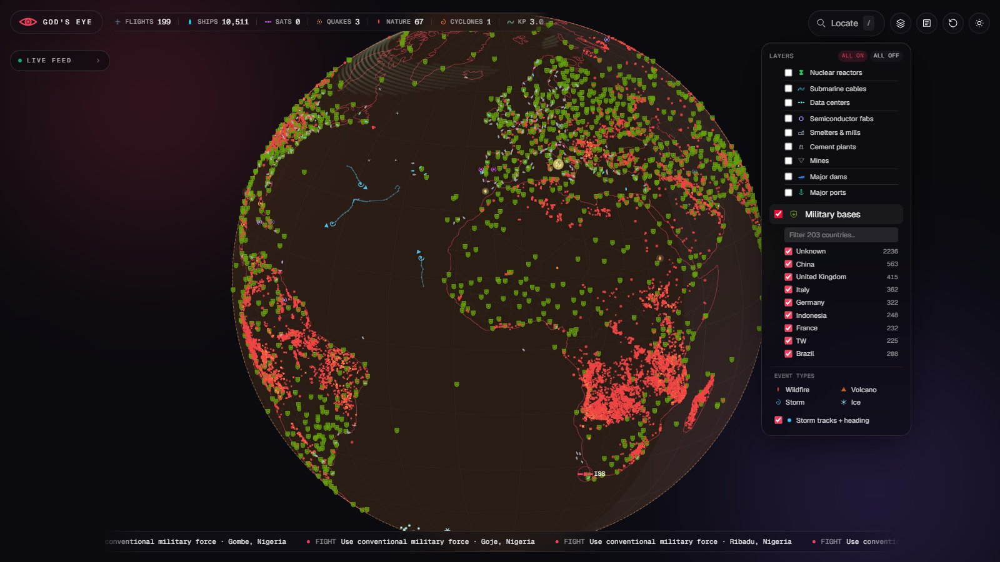
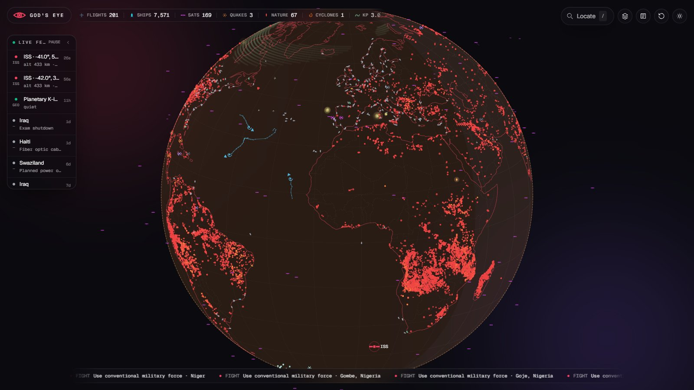
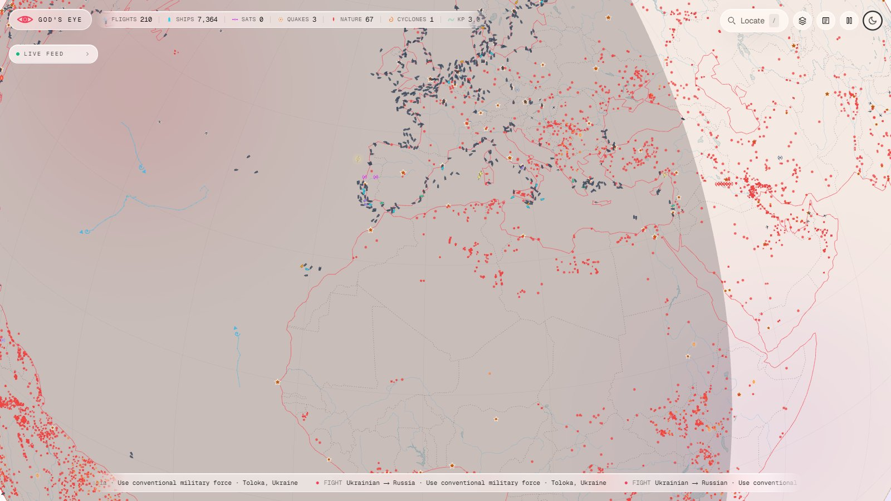
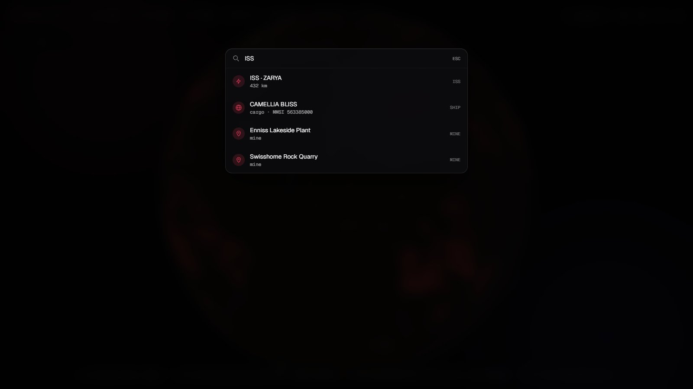
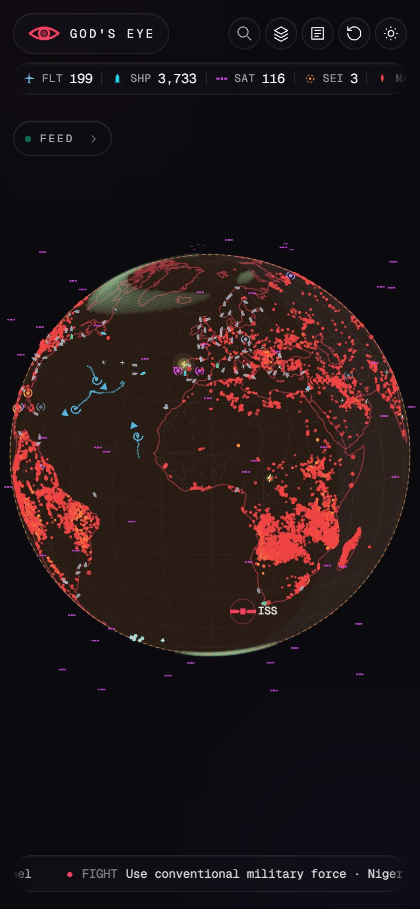

# God's Eye

**A live, wireframe-globe view of the planet — flights, ships, satellites, earthquakes, storms, fires, news and critical infrastructure, streamed from public data feeds into one dashboard.**

**▶ Live: [gods-eye-phi.vercel.app](https://gods-eye-phi.vercel.app)**



> Data is shown as-is from third-party public sources and may be delayed, incomplete or wrong. **Not for navigation, safety or emergency use.** See [Terms of Use](TERMS.md).

---

## Highlights

- **25+ data layers** on a D3 orthographic globe — live traffic, natural hazards, space weather, geocoded news and ~20 categories of critical infrastructure.
- **Real-time streaming.** Ships and aircraft arrive over a single Server-Sent Events connection, with dead-reckoning between updates so nothing teleports.
- **Locate anything** (`/`) — search flights, vessels, satellites, the ISS, quakes, news and infrastructure, then lock on and track.
- **Live feed + ticker** of the newest events across every layer; click to fly there.
- **Level-of-detail rendering** — coastlines, borders, rivers and city labels sharpen as you zoom.
- **Dark and light themes**, glass-morphism UI, and a compact mobile layout.

## Screenshots

| | |
|---|---|
|  |  |
| **Zoomed in** — ships, aircraft, fires and cities around the Mediterranean | **Layers panel** — military bases with the per-country filter |
|  |  |
| **Live feed** — newest events across all sources | **Light theme** |
|  |  |
| **Locate** (`/`) — search any object and lock on | **Mobile** |

## Layers

### Live

| Layer | Source |
|---|---|
| Flights | [airplanes.live](https://airplanes.live), [adsb.lol](https://adsb.lol), [adsb.fi](https://adsb.fi) (ADS-B); routes and airlines from [ADSBdb](https://www.adsbdb.com); optional ADS-B Exchange for ocean coverage |
| Ships | [AISStream](https://aisstream.io) (AIS), with 30-day position history in Postgres |
| Satellites | CelesTrak TLEs via [tle.ivanstanojevic.me](https://tle.ivanstanojevic.me), propagated in-browser with satellite.js |
| ISS | [wheretheiss.at](https://wheretheiss.at) |
| Earthquakes | [USGS](https://earthquake.usgs.gov) |
| Natural events | [NASA EONET](https://eonet.gsfc.nasa.gov) — open storms, wildfires, volcanoes, ice |
| Active fires | [NASA FIRMS](https://firms.modaps.eosdis.nasa.gov) VIIRS thermal hotspots |
| Tropical cyclones | [NOAA NHC](https://www.nhc.noaa.gov) — tracks and heading |
| Lightning | [Blitzortung](https://www.blitzortung.org) community network |
| Wind flow | [Open-Meteo](https://open-meteo.com) (GFS / ECMWF), animated particles |
| Ocean currents | Open-Meteo Marine |
| Aurora / geomagnetic Kp | [NOAA SWPC](https://www.swpc.noaa.gov) |
| Internet outages | [Cloudflare Radar](https://radar.cloudflare.com) |
| News | [GDELT 2.0](https://www.gdeltproject.org) — geocoded events from the last 8 hours |
| Day / night | Computed subsolar point (terminator shade) |
| Tsunami archive | [NOAA NCEI](https://www.ngdc.noaa.gov/hazard/tsu.shtml) |

### Critical infrastructure

| Group | Layers | Source |
|---|---|---|
| Energy | Oil refineries, gas processing, LNG terminals, oil/gas pipelines, power plants ≥100 MW, nuclear reactors | OpenStreetMap, [WRI Global Power Plant DB](https://datasets.wri.org/dataset/globalpowerplantdatabase), [GeoNuclearData](https://github.com/cristianst85/GeoNuclearData), Global Energy Monitor, curated lists |
| Digital | Data centers (cloud regions + colo operators, with live provider status), submarine cables | [PeeringDB](https://www.peeringdb.com), provider status pages, [TeleGeography](https://www.submarinecablemap.com) |
| Industrial | Semiconductor fabs, smelters & mills, cement plants, mines | Curated list, OpenStreetMap |
| Transport & water | Major ports, major dams | Curated list, OpenStreetMap |
| Military | ~9,200 military sites, filterable by country | OpenStreetMap (static snapshot, rebuilt by `scripts/build-military-bases.mjs`) |

Every infrastructure location comes from openly published data; nothing here is non-public.

## Controls

| Input | Action |
|---|---|
| `/` | Open Locate search |
| `Esc` | Close dossier / stop tracking |
| `R` | Stop tracking and release the view |
| Drag · scroll · pinch | Rotate and zoom |
| Click an object | Open its dossier and lock on |

## Architecture

```
Browser
  index.html      boot shell — React 18 + Babel standalone, Tailwind,
                  D3 v7, topojson, satellite.js (all via CDN)
  src/app2.jsx    app shell: panels, search, filters, feed
  src/globe2.jsx  canvas globe renderer with level-of-detail
  src/*.jsx       per-layer loaders
      │ fetch / EventSource                 │ WebSocket
      ▼                                     ▼
Vercel Functions (api/)                Blitzortung (lightning)
  stream.js   single SSE stream: ships (AISStream) + flights (ADS-B)
  *.js        one proxy per layer — CORS, filtering, caching
      │
      ▼
Neon Postgres — ship position history (30 days)
```

Design notes:

- **No build step.** JSX is compiled in the browser by Babel standalone; a deploy is static files plus functions.
- **One stream per visitor.** Ships and flights share a single SSE connection, so each open tab holds one warm function instance rather than two.
- **Keys stay server-side.** Every API key lives in Vercel environment variables and is only read inside `api/` functions; nothing secret is sent to the browser.
- **Lightning connects browser-direct** because Blitzortung drops connections from cloud IP ranges.

## Project structure

```
api/               Vercel serverless functions (one per layer, plus stream.js)
  _*.js            shared helpers: Overpass, GEM loader, CSV, ship DB
src/
  app2.jsx         React app shell
  globe2.jsx       globe renderer
  data.jsx         public-API fetchers
  *.jsx            layer modules
  data/*.json      curated and snapshot datasets
scripts/           dataset snapshot builders
docs/screenshots/  README images
index.html         boot shell
vercel.json        function memory / duration limits
```

## Running locally

Requires the [Vercel CLI](https://vercel.com/docs/cli).

```bash
vercel link
vercel env pull .env.local    # development env vars
vercel dev
```

The globe runs without any keys; a layer whose key is missing just stays empty.

### Environment variables

| Name | Layer | Get one |
|---|---|---|
| `AISSTREAM_KEY` | Ships | [aisstream.io](https://aisstream.io) (free) |
| `FIRMS_MAP_KEY` | Active fires | [NASA FIRMS](https://firms.modaps.eosdis.nasa.gov/api/map_key/) (free) |
| `CLOUDFLARE_API_TOKEN` | Internet outages | Cloudflare API token with *Radar: Read* |
| `DATABASE_URL` / `POSTGRES_URL` | Ship history (optional) | [Neon](https://neon.tech) via the Vercel integration |
| `ADSBX_RAPIDAPI_KEY` | Ocean flight coverage (optional) | ADS-B Exchange on RapidAPI |

`.env*` files are git-ignored — never commit them.

## Deploy

Pushes to `main` deploy to production through the Vercel ↔ GitHub integration. `main` is protected; changes land via pull request.

## Terms & credits

Use of the site and this code is covered by the [Terms of Use](TERMS.md).

Built on open data from USGS, NASA (EONET, FIRMS), NOAA (SWPC, NHC, NCEI), CelesTrak, airplanes.live, adsb.lol, adsb.fi, ADSBdb, AISStream, Blitzortung, Open-Meteo, GDELT, Cloudflare Radar, PeeringDB, TeleGeography, WRI, Global Energy Monitor, GeoNuclearData, Natural Earth ([world-atlas](https://github.com/topojson/world-atlas)) and © [OpenStreetMap](https://www.openstreetmap.org/copyright) contributors (ODbL). All data remains the property of its respective publishers.
